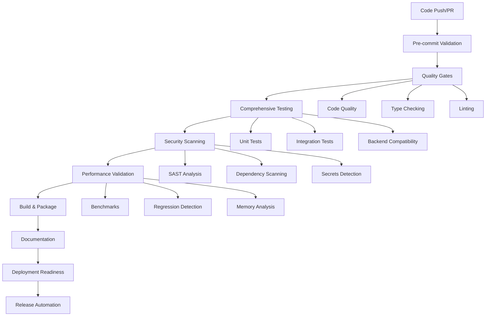

# CI/CD Architecture Documentation

## Overview

The Neural Architecture Framework employs an enterprise-grade CI/CD pipeline designed to ensure the highest levels of code quality, security, and reliability. This document provides a comprehensive overview of the CI/CD architecture, workflows, and best practices.

## Table of Contents

- [Pipeline Architecture](#pipeline-architecture)
- [Workflow Overview](#workflow-overview)
- [Quality Gates](#quality-gates)
- [Security Integration](#security-integration)
- [Performance Monitoring](#performance-monitoring)
- [Deployment Strategy](#deployment-strategy)
- [Monitoring & Observability](#monitoring--observability)
- [Troubleshooting Guide](#troubleshooting-guide)

## Pipeline Architecture

### Multi-Stage Pipeline Design

The CI/CD pipeline follows a sophisticated multi-stage architecture:

### Core Principles

1. **Fail Fast**: Critical quality gates run first to provide immediate feedback
2. **Parallel Execution**: Independent jobs run concurrently to minimize pipeline time
3. **Progressive Validation**: More comprehensive tests run after basic validations pass
4. **Environment Parity**: Testing across multiple Python versions and operating systems
5. **Security First**: Security scanning integrated throughout the pipeline

## Workflow Overview

### 1. Main CI/CD Pipeline (`ci-main.yml`)

**Triggers**: Push to main/develop, Pull Requests, Manual dispatch

**Stages**:
- **Pre-commit Validation**: Basic structure and cache setup
- **Code Quality**: Black, isort, flake8, mypy validation
- **Security Scan**: Bandit, Safety, pip-audit scanning
- **Unit Tests**: Cross-platform testing matrix (Python 3.8-3.12, Ubuntu/Windows/macOS)
- **Integration Tests**: End-to-end validation with CLI testing
- **Backend Compatibility**: NumPy, CUDA (mocked), MPS (mocked) testing
- **Performance Benchmarks**: Baseline performance validation
- **Build & Package**: Multi-platform wheel building and validation
- **Documentation Build**: Sphinx documentation generation
- **Deployment Readiness**: Final validation checkpoint

**Key Features**:
- Matrix testing across 15 environment combinations
- Intelligent caching for Python dependencies
- Comprehensive coverage reporting (95%+ target)
- Artifact retention for debugging and analysis

### 2. Release Automation (`release.yml`)

**Triggers**: Version tags, Manual release dispatch

**Stages**:
- **Release Validation**: Version format, changelog verification
- **Comprehensive Testing**: Full test suite across all environments
- **Build Artifacts**: Multi-platform distribution building
- **Security Validation**: Final security scan before release
- **GitHub Release**: Automated release creation with notes
- **PyPI Publishing**: Automated package publishing
- **Post-Release**: Development version updates and cleanup

**Key Features**:
- Semantic versioning validation
- Pre-release and stable release support
- Automated changelog integration
- SBOM generation for supply chain security
- Rollback capability for failed releases

### 3. Performance Monitoring (`performance.yml`)

**Triggers**: Code changes, Daily schedule, Manual dispatch

**Stages**:
- **Performance Baseline**: Establish comparison metrics
- **Core Performance**: Tensor operations, arithmetic, activations
- **Model Performance**: GPT-2, BERT, ViT, ResNet, CLIP benchmarking
- **Backend Performance**: NumPy, JIT, CUDA performance comparison
- **Memory Profiling**: Memory usage and leak detection
- **Regression Detection**: Performance trend analysis

**Key Features**:
- Automated performance regression alerts (>10% threshold)
- Historical performance tracking
- Memory profiling with leak detection
- Benchmark result visualization
- PR performance impact reporting

### 4. Nightly Testing (`nightly.yml`)

**Triggers**: Daily at 2 AM UTC, Manual dispatch

**Stages**:
- **Extended Compatibility**: Comprehensive cross-platform testing
- **Stress Testing**: High-load and endurance testing
- **Security Deep Scan**: Comprehensive security validation
- **Performance Regression**: Extended performance analysis
- **Comprehensive Reporting**: Detailed health and quality reports

**Key Features**:
- 3-hour stress testing capability
- Memory leak detection (10,000 iterations)
- Comprehensive security scanning with multiple tools
- Automated issue creation for failures
- Long-term trend analysis

### 5. Security Scanning (`security.yml`)

**Triggers**: Code pushes, Daily schedule, Manual dispatch

**Stages**:
- **SAST Analysis**: Bandit, Semgrep static analysis
- **Dependency Scanning**: Safety, pip-audit, OSV Scanner
- **Secrets Detection**: Gitleaks, TruffleHog, detect-secrets
- **Supply Chain Security**: License analysis, SBOM generation
- **Compliance Reporting**: Comprehensive security reporting

**Key Features**:
- Multiple security tools for comprehensive coverage
- SARIF reporting for GitHub Security tab
- Software Bill of Materials (SBOM) generation
- License compatibility validation
- Automated security issue creation

### 6. Documentation (`docs.yml`)

**Triggers**: Documentation changes, Daily rebuild

**Stages**:
- **Documentation Validation**: Markdown, structure, link validation
- **Sphinx Build**: API documentation generation
- **API Documentation**: Auto-generated module documentation
- **GitHub Pages Deploy**: Automated documentation deployment

**Key Features**:
- Automated API documentation from docstrings
- Link validation and structure checking
- Multi-format documentation generation
- Automated deployment to GitHub Pages

### 7. Monitoring & Observability (`monitoring.yml`)

**Triggers**: Workflow completions, Daily/Weekly health checks

**Stages**:
- **Pipeline Health Analysis**: Success rates, failure patterns
- **Performance Trend Analysis**: Long-term performance tracking
- **Quality Metrics Collection**: Code quality and repository health
- **Comprehensive Health Report**: Executive summary with recommendations

**Key Features**:
- Health score calculation (0-100)
- Automated alert generation for critical issues
- Performance trend visualization
- Quality metrics dashboard

## Quality Gates

### Code Quality Gates

1. **Formatting**: Black code formatting (100 char lines)
2. **Import Sorting**: isort with Black profile compatibility
3. **Linting**: flake8 with enterprise-grade rules
4. **Type Checking**: mypy strict mode with type annotations
5. **Security**: Bandit static security analysis

### Testing Gates

1. **Unit Tests**: 95%+ coverage requirement across all modules
2. **Integration Tests**: End-to-end workflow validation
3. **Backend Compatibility**: Multi-backend testing with mocking
4. **Performance**: Benchmark execution within tolerance
5. **Documentation**: API documentation completeness

### Security Gates

1. **Static Analysis**: Multi-tool SAST scanning
2. **Dependency Security**: Vulnerability scanning with multiple tools
3. **Secret Detection**: Multi-tool secret scanning
4. **License Compliance**: License compatibility validation
5. **Supply Chain**: SBOM generation and validation

## Security Integration

### Security-First Approach

The CI/CD pipeline integrates security at every stage:

1. **Pre-commit Hooks**: Local security validation
2. **SAST Integration**: Static analysis on every commit
3. **Dependency Scanning**: Automated vulnerability detection
4. **Secret Detection**: Multi-tool secret scanning
5. **Compliance Reporting**: Automated security compliance reports

### Security Tools

- **SAST**: Bandit, Semgrep
- **Dependency Scanning**: Safety, pip-audit, OSV Scanner
- **Secret Detection**: Gitleaks, TruffleHog, detect-secrets
- **License Scanning**: pip-licenses, cyclonedx-bom
- **Container Security**: Hadolint (for future Docker support)

### Security Workflows

1. **Continuous Scanning**: Every commit scanned for security issues
2. **Daily Deep Scans**: Comprehensive security validation
3. **Release Security**: Final security validation before releases
4. **Compliance Reporting**: Regular security posture reporting

## Performance Monitoring

### Performance Testing Strategy

1. **Baseline Establishment**: Performance baseline for comparisons
2. **Core Operations**: Tensor operations, arithmetic, activations
3. **Model Performance**: End-to-end model benchmarking
4. **Backend Testing**: Multi-backend performance comparison
5. **Memory Profiling**: Memory usage and leak detection

### Regression Detection

1. **Automated Thresholds**: 10% performance degradation alerts
2. **Historical Tracking**: Long-term performance trend analysis
3. **PR Impact**: Performance impact reporting on pull requests
4. **Visualization**: Performance trend charts and dashboards

### Performance Metrics

- **Execution Time**: Benchmark execution duration
- **Memory Usage**: Peak and average memory consumption
- **Throughput**: Operations per second measurements
- **Scalability**: Performance across different data sizes

## Deployment Strategy

### Multi-Environment Strategy

1. **Development**: Feature branch validation
2. **Integration**: Main branch comprehensive testing
3. **Staging**: Release candidate validation
4. **Production**: Stable release deployment

### Release Process

1. **Version Tagging**: Semantic version tag creation
2. **Release Validation**: Comprehensive pre-release testing
3. **Artifact Building**: Multi-platform package creation
4. **Security Validation**: Final security scan
5. **Publishing**: PyPI and GitHub release publication
6. **Post-Release**: Version updates and notifications

### Rollback Strategy

1. **Automated Validation**: Pre-deployment validation
2. **Rollback Triggers**: Automated failure detection
3. **Quick Rollback**: Rapid rollback to previous version
4. **Communication**: Automated stakeholder notification

## Monitoring & Observability

### Pipeline Health Monitoring

1. **Success Rate Tracking**: Pipeline success/failure rates
2. **Performance Monitoring**: Pipeline execution time tracking
3. **Quality Trends**: Code quality metric trending
4. **Health Scoring**: Overall pipeline health calculation

### Alerting & Notifications

1. **Failure Alerts**: Immediate notification of pipeline failures
2. **Performance Alerts**: Performance regression notifications
3. **Security Alerts**: Security issue notifications
4. **Health Reports**: Regular health status reporting

### Dashboards & Reporting

1. **Pipeline Dashboard**: Real-time pipeline status
2. **Performance Dashboard**: Performance metrics visualization
3. **Quality Dashboard**: Code quality metrics display
4. **Health Reports**: Comprehensive health analysis

## Troubleshooting Guide

### Common Issues & Solutions

#### Pipeline Failures

**Issue**: Workflow jobs failing unexpectedly
**Solutions**:
1. Check job logs for specific error messages
2. Verify dependency installation issues
3. Check for environment-specific failures
4. Review recent changes for breaking modifications

**Issue**: Test failures in CI but passing locally
**Solutions**:
1. Check Python version compatibility
2. Verify environment variable configuration
3. Check for timing-dependent test issues
4. Review platform-specific differences

#### Performance Issues

**Issue**: Pipeline execution taking too long
**Solutions**:
1. Check for inefficient test implementations
2. Review caching strategy effectiveness
3. Consider job parallelization improvements
4. Optimize dependency installation

**Issue**: Performance benchmarks failing
**Solutions**:
1. Check for performance regressions in recent changes
2. Verify benchmark stability and consistency
3. Review system resource availability
4. Check for external dependencies affecting performance

#### Security Scan Issues

**Issue**: False positive security alerts
**Solutions**:
1. Review security tool configuration
2. Add legitimate exceptions to baseline files
3. Update security tool versions
4. Configure tool-specific ignore patterns

**Issue**: Dependency vulnerability alerts
**Solutions**:
1. Update vulnerable dependencies
2. Check for security patches
3. Consider alternative dependencies
4. Add temporary exceptions with tracking

### Debugging Workflows

#### Accessing Logs

1. **GitHub Actions**: Navigate to Actions tab → Select workflow run → Review job logs
2. **Artifact Download**: Download artifacts for detailed analysis
3. **Local Reproduction**: Reproduce issues locally using same environment

#### Common Debugging Steps

1. **Check Environment**: Verify Python version, OS, and dependencies
2. **Review Recent Changes**: Check recent commits for breaking changes
3. **Examine Dependencies**: Check for dependency conflicts or updates
4. **Validate Configuration**: Ensure configuration files are correct

#### Debug Modes

1. **Verbose Logging**: Enable detailed logging for troubleshooting
2. **Debug Builds**: Create debug builds with additional information
3. **Step-by-Step Execution**: Break down complex workflows into steps
4. **Local Testing**: Test workflow components locally

### Performance Optimization

#### Pipeline Optimization

1. **Caching Strategy**: Implement comprehensive dependency caching
2. **Job Parallelization**: Run independent jobs concurrently
3. **Matrix Optimization**: Optimize test matrix for coverage vs. speed
4. **Resource Allocation**: Ensure adequate resources for jobs

#### Test Optimization

1. **Test Categorization**: Separate fast and slow tests
2. **Parallel Execution**: Use pytest-xdist for parallel test execution
3. **Test Mocking**: Mock external dependencies to improve speed
4. **Selective Testing**: Run only relevant tests for specific changes

### Maintenance & Updates

#### Regular Maintenance Tasks

1. **Dependency Updates**: Regular dependency version updates
2. **Tool Updates**: Keep CI/CD tools up to date
3. **Configuration Review**: Regular review of configuration files
4. **Performance Review**: Regular performance benchmark review

#### Security Maintenance

1. **Security Updates**: Regular security tool updates
2. **Vulnerability Patching**: Prompt vulnerability resolution
3. **Access Review**: Regular access and permission review
4. **Compliance Monitoring**: Ongoing compliance monitoring

#### Documentation Maintenance

1. **Documentation Updates**: Keep documentation current with changes
2. **Process Documentation**: Document new processes and procedures
3. **Knowledge Transfer**: Ensure team knowledge sharing
4. **Training Materials**: Maintain training and onboarding materials

---

## Contact Information

- **DevOps Team**: devops@neural-arch.ai
- **Security Team**: security@neural-arch.ai
- **QA Team**: qa@neural-arch.ai
- **Performance Team**: performance@neural-arch.ai

For technical issues or questions about the CI/CD pipeline, please create an issue in the repository or contact the appropriate team.

---

*This documentation is maintained by the Neural Architecture Framework DevOps team and is updated regularly to reflect the current CI/CD architecture and best practices.*